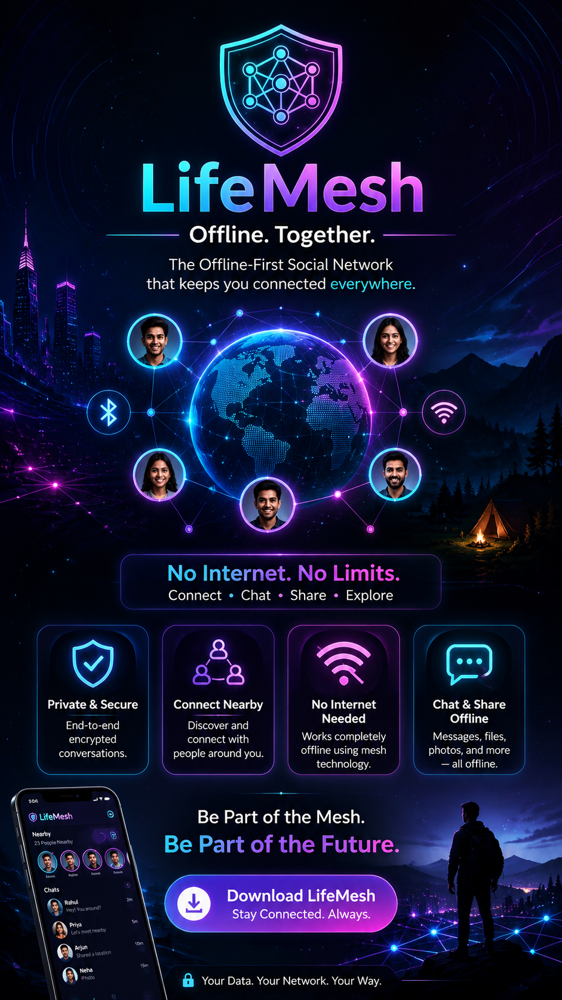

# LifeMesh

> **Offline. Together.> **
> The Future of Decentralized Human Connection.


# 🚀 FUTURE OF LIFEMESH

> **When you implement:> **

  * relay routing
  * store-and-forward
  * offline propagation
  * delayed delivery
# 🚀 then:
LifeMesh becomes:📊 Real decentralized local internet layer.



---

# 🚀 Overview

LifeMesh is a futuristic offline-first mesh social network built with Flutter.

It allows nearby smartphones to:

* communicate
* share files
* discover people
* build local communities
* create AI-powered memory timelines

WITHOUT internet.

LifeMesh transforms smartphones into decentralized mesh nodes using:

* Bluetooth LE
* WiFi Direct
* Nearby Connections
* Peer-to-peer networking

The goal is to create:

> “The Offline Internet Layer.”

---

# 📊 Real Implementation Status Report (Audit May 2026)

This project is currently in a **Hybrid Foundation** state: The transport layer is functional, but the application layer is simulated.

### 1. Transport & Discovery (Functional)
*   **BLE/Nearby Mesh:** Functional via `nearby_connections`. Supports real P2P clustering, bidirectional handshakes, and identity exchange.
*   **LAN/WiFi Mesh:** Functional via UDP broadcasting and local HTTP `shelf` servers for presence and heartbeats.
*   **Hybrid Sync:** Real-time synchronization of nearby nodes into the local Isar database.
*   **Network Stats:** Real signal strength (RSSI) and node counts are actively measured and displayed.

### 2. Security (Partial)
*   **Encryption:** Implemented using Chacha20-Poly1305.
*   **Limitation:** Currently uses a static network key. Peer-to-peer Diffie-Hellman key exchange is pending.

### 3. Application Features (Simulated/UI-Only)
*   **Mesh Chat:** UI is functional, but messages are NOT transmitted over the mesh. They are locally inserted with a simulated delay.
*   **File Sharing:** Progress bar and UI are functional, but no actual bytes are transferred.
*   **Disaster Mode / Marketplace / Games:** Powered entirely by mock data controllers.

### 4. Technical Debt & Priority
*   **Router Implementation:** Need to connect `ChatDetailController` and `FileSharingController` to the `MeshNetworkService`.
*   **File Chunking:** Implementation of byte-stream chunking for large file transfers over Nearby payloads.
*   **Relay Logic:** Implementation of multi-hop routing (gossip protocols) to extend mesh range beyond immediate P2P.

---

# 🌐 Why LifeMesh?

Most apps depend completely on:

* internet
* cloud servers
* telecom infrastructure

LifeMesh changes that.

With LifeMesh, users can:

* chat offline
* share files nearby
* create local social feeds
* discover nearby users
* communicate during disasters
* build mesh-powered communities

all without internet.

---

# ✨ Core Features

# 🔗 Offline Mesh Networking

Connect nearby users using:

* Bluetooth LE
* WiFi Direct
* Peer-to-peer communication

---

# 💬 Offline Mesh Chat

* Direct messaging
* Group chat
* Voice notes
* Nearby communication
* Delay-tolerant messaging

---

# 📡 Nearby Discovery

Find nearby LifeMesh users in real time.

Features:

* live nearby scanning
* distance indicators
* signal strength
* mesh node visualization

---

# 📂 Offline File Sharing

Share:

* photos
* videos
* documents
* apps
* audio files

without internet.

---

# 🧠 AI Timeline System

LifeMesh can reconstruct user activity timeline locally.

Example:

> “What happened on 14 March?”

AI can generate:

* places visited
* nearby users
* files shared
* photos captured
* interactions

---

# 🛒 Local Marketplace

Offline local commerce system.

Users nearby can:

* buy
* sell
* barter
* offer services

---

# 🚨 Disaster Mode

Emergency communication during:

* internet shutdowns
* floods
* earthquakes
* remote travel

Features:

* SOS alerts
* nearby rescue communication
* offline emergency broadcasting

---

# 🎮 Offline Multiplayer Games

Play nearby multiplayer games without internet.

---

# 🧩 Tech Stack

## Frontend

* Flutter
* Dart
* GetX

## Database

* Isar Database
* GetStorage

## Networking

* Bluetooth LE
* Nearby Connections API
* WiFi Direct

## Location

* Geolocator
* Geocoding

## Local Storage

* Isar
* SharedPreferences
* Local cache

## UI

* Glassmorphism
* Cyberpunk Neon UI
* Animated mesh backgrounds

---

# 📱 App Flow

```text
Splash Screen
    ↓
Identity Setup
    ↓
Personal Information
    ↓
Review
    ↓
Permissions
    ↓
Discover Nearby Users
    ↓
Final Welcome
    ↓
Home Dashboard
```

---

# 🧱 Current Modules

* [x] Splash Screen
* [x] Identity Setup
* [x] Personal Information
* [x] Review Screen
* [x] Permission Handling
* [x] Hybrid Mesh Transport (Nearby & LAN)
* [x] Real-time Node Discovery
* [x] Encryption Layer (Chacha20)
* [x] Home Dashboard UI
* [ ] Real Chat Transmission
* [ ] Real File Transfer
* [ ] AI Timeline Engine
* [ ] Marketplace Backend
* [ ] Multi-hop Mesh Relay Routing

---
# 📂 Project Structure

```text
.
├── android/             # Android-native configuration and code
├── ios/                 # iOS-native configuration and code
├── lib/                 # Core Flutter source code (Dart)
├── LifeMeshui/          # UI design assets and screenshots
├── test/                # Unit and widget tests
└── pubspec.yaml         # Project dependencies and metadata

lib/
├── core/                # Core configurations, services, and constants
│   ├── constants/       # App-wide constants (e.g., mesh states)
│   ├── services/        # Shared services (e.g., database, nearby discovery)
│   ├── app_colors.dart
│   └── app_theme.dart
├── features/            # Feature-based modules (Clean Architecture)
│   ├── auth/            # Identity setup and onboarding
│   ├── chat/            # Offline mesh chat
│   ├── disaster/        # SOS and emergency communication
│   ├── feed/            # Local social feed
│   ├── files/           # Peer-to-peer file sharing
│   ├── games/           # Offline multiplayer games
│   ├── home/            # Dashboard and main navigation
│   ├── marketplace/     # Local offline commerce
│   ├── profile/         # User profile management
│   ├── settings/        # App settings and configurations
│   └── timeline/        # AI-powered memory timeline
├── models/              # Data models and generated files
└── widgets/             # Reusable UI components
```

---

# 🗄️ Database Architecture

## Isar Database

Used for:

* onboarding data
* nearby users
* AI timeline
* local feed
* chats
* mesh cache

## GetStorage

Used for:

* onboarding step cache
* permissions
* app settings
* quick local state

---

# 🎨 UI Design

LifeMesh uses:

* futuristic cyberpunk design
* neon gradients
* glassmorphism
* animated mesh nodes
* dark cosmic backgrounds

Primary Colors:

* Purple
* Cyan
* Deep Navy
* Neon Pink

---

# 🔐 Privacy First

LifeMesh is designed with privacy-first architecture.

Features:

* offline-first system
* local database storage
* no mandatory cloud dependency
* encrypted communication
* user-controlled data

---

# ⚡ Vision

LifeMesh aims to become:

> “The decentralized social layer for humanity.”

A platform where:

* nearby people connect freely
* communities communicate offline
* users own their data
* AI understands local experiences

---

# 🛠️ Setup

## Clone Repository

```bash
git clone https://github.com/yourusername/lifemesh.git
```

---

## Install Packages

```bash
flutter pub get
```

---

## Run Build Runner

```bash
flutter pub run build_runner build --delete-conflicting-outputs
```

---

## Run Project

```bash
flutter run
```

---

# 📦 Main Packages

```yaml
get:
isar:
isar_flutter_libs:
get_storage:
permission_handler:
image_picker:
geolocator:
geocoding:
flutter_animate:
```

---

# 🚧 Development Status

```text
🟢 UI System: Functional / Themed
🟢 Onboarding: Functional
🟢 Local Database: Working (Isar)
🟢 Mesh Transport: Functional (Hybrid)
🟡 App Integration: Simulated (Chat/Files)
🔴 AI Timeline Engine: Pending
🔴 Multi-hop Routing: Pending
```

---

# 📸 Screenshots

## Onboarding

* Splash Screen
* Identity Setup
* Permissions
* Discovery

## Dashboard

* Nearby Feed
* Mesh Chat
* Marketplace
* AI Timeline

---

# 🌟 Future Plans

* Real mesh routing
* Multi-hop communication
* AI memory reconstruction
* Offline TikTok-style feed
* AR nearby discovery
* Voice relay system
* Disaster mesh protocol
* Decentralized local economy

---

# 🤝 Contribution

Contributions are welcome.

Ideas:

* mesh networking
* offline communication
* Flutter optimization
* AI timeline system
* decentralized systems

---

# 📄 License

MIT License

---

# 👨‍💻 Developer

Developed by Aftab Shah

> Building the future of offline communication.

---

# 💡 Taglines

* Offline. Together.
* No Internet. No Limits.
* Your Nearby Digital World.
* Human Connection Beyond Internet.
* The Offline Internet.
* Stay Connected Anywhere.
